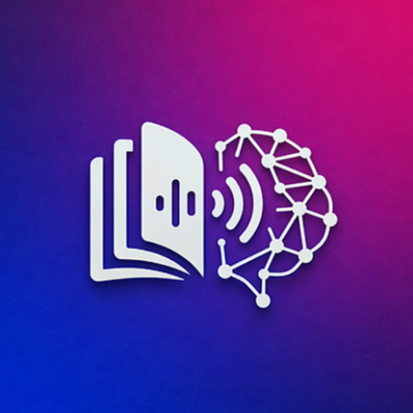

# NeuRead Android

[](https://opensource.org/licenses/MIT)
[](https://www.android.com/)
[](https://kotlinlang.org/)
[](https://play.google.com/store/apps/details?id=com.psimandan.neuread)

Cititor de e-book cu Text-to-Speech și Audiobook Player pentru Android - Ascultă cărțile tale cu voci AI de înaltă calitate!



## Prezentare generală

NeuRead este o aplicație Android care convertește textul în vorbire folosind un model AI de ultimă generație, NeuTTS Air. Suportă diverse formate de e-book și oferă o interfață curată și intuitivă pentru gestionarea bibliotecii și controlul redării cu atât TTS local cât și voci AI de pe server.

## Funcționalități

- **Voci AI avansate**: Voci de înaltă calitate și naturale (Adrian, Andreea, Mihaela, Mihai, și alte modele personalizate)
- **Clonare vocală**: Creează-ți propria voce digitală prin înregistrarea unui scurt eșantion (suportă limba engleză, spaniolă, franceză, germană și română)
- **Redare text-to-speech**: Convertește orice text sau e-book în vorbire
- **Tranzițiile fără întreruperi**: Comută instantaneu între TTS local și piste audio AI de înaltă calitate
- **Suport audiobook**: Ascultă audiobook-uri de înaltă calitate generate folosind pipeline-ul NeuTTS
- **Semne de carte**: Salvează și sari la poziții specifice în cărțile tale
- **Control viteză**: Ajustează viteza de redare după preferință
- **Gestionare bibliotecă**: Organizează cărțile în interfață curată și intuitivă
- **Suport formate e-book**: Citește EPUB, PDF, fișiere text simplu și arhive personalizate
- **Redare în background**: Continuă ascultarea chiar și când aplicația este în background
- **Controale media**: Controlează redarea din ecranul blocat sau notificare
- **Text evidențiat**: Urmărește textul evidențiat în timp ce este citit
- **Font dislexic**: Folosește un font special gândit pentru persoanele cu dislexie

**Descarcă și folosește aplicația gratuit!**

## Instalare

### Din cod sursă

1. Clonează depozitul:
   ```
   git clone https://github.com/psimandan/NeuRead.git
   ```

2. Deschide proiectul în Android Studio

3. Compilează și rulează aplicația pe dispozitivul tău sau emulator

---

## Arhitectură

NeuRead urmează pattern-ul de arhitectură MVVM (Model-View-ViewModel) și este construit cu instrumentele și bibliotecile moderne de dezvoltare Android.

### Arhitectura de nivel înalt


### Caracteristici arhitecturale cheie

- **Arhitectură curată**: Separarea preocupărilor în straturi distincte
- **Pattern MVVM**: UI reactiv cu ViewModel-uri care gestionează starea
- **Motor de redare hibrid**: Comută fără probleme între TTS local (`SpeechBookPlayer`) și Audio AI (`AudioBookPlayer`)
- **Injecție de dependențe**: Hilt pentru gestionare curată a dependențelor
- **Responsabilitate unică**: Fiecare componentă are un scop bine definit
- **Design testabil**: Interfețele și injecția de dependențe permit testarea ușoară
- **Android modern**: Construit cu Jetpack Compose și cele mai recente API-uri Android


## Tehnologii utilizate

- **Kotlin**: Limbaj modern și concis pentru Android
- **Jetpack Compose**: Toolkit declarativ pentru construirea UI-ului nativ Android
- **Coroutines & Flow**: Pentru programare asincronă reactivă
- **Hilt**: Pentru injecție de dependențe
- **Media3 (ExoPlayer)**: Pentru redare audio de înaltă precizie
- **Android TTS & NeuTTS API**: Pentru conversia vorbire pe mai multe motoare
- **Jetpack Navigation**: Pentru navigare în-aplicație
- **DataStore**: Pentru preferințe și stocare voci clonate

## Configurarea serverului NeuTTS

### Cerințe preliminare

- Python 3.13
- GPU NVIDIA cu suport CUDA (recomandat pentru performanță)
- Cel puțin 8GB VRAM

### Rularea serverului

1. **Instalează dependențele:**
   ```bash
   pip install -r requirements.txt
   ```

2. **Pornește serverul FastAPI:**
   ```bash
   python server.py
   ```

## Deployment cu Docker

NeuTTS poate fi ușor deploiat folosind Docker și Docker Compose. Proiectul include fișiere de configurare Docker optimizate pentru CPU și GPU.

### Cerințe preliminare pentru Docker

- Docker
- Docker Compose
- Pentru GPU: NVIDIA Docker runtime

### Deployment CPU

1. **Construiește imaginea Docker:**
   ```bash
   docker build -f neutts-main/Dockerfile -t neutts-server:latest .
   ```

2. **Rulează containerul:**
   ```bash
   docker run --rm -p 8000:8000 \
     -e BACKBONE_PATH=/app/data/neutts-romanian-finetune/checkpoint-370000 \
     -v /host/path/to/models:/app/data:ro \
     neutts-server:latest
   ```

3. **Sau folosește Docker Compose:**
   ```bash
   docker-compose up
   ```

### Deployment GPU (NVIDIA CUDA)

1. **Construiește imaginea Docker optimizată pentru GPU:**
   ```bash
   docker build -f neutts-main/Dockerfile.gpu -t neutts-server:gpu .
   ```

2. **Rulează containerul cu GPU:**
   ```bash
   docker run --rm --gpus all -p 8000:8000 \
     -e BACKBONE_DEVICE=cuda -e CODEC_DEVICE=cuda \
     -e BACKBONE_PATH=/app/data/neutts-romanian-finetune/checkpoint-370000 \
     -v /host/path/to/models:/app/data:ro \
     neutts-server:gpu
   ```

3. **Sau folosește Docker Compose cu GPU:**
   ```bash
   docker-compose -f docker-compose.gpu.yml up
   ```


## Antrenare model

Pentru a antrena modelul NeuTTS, consultă:

- `neutts-main/TRAINING.md` - Ghid complet de antrenare
- `neutts-main/examples/VOICE_CLONING_README.md` - Ghid tehnic pentru clonarea vocală


### Configurarea mediului de dezvoltare

1. **Cerințe preliminare**
   - Android Studio Electric Eel sau mai nou
   - JDK 11 sau mai nou
   - Android SDK cu nivelul API 24+

2. **Clonare și configurare**
   ```bash
   git clone https://github.com/numipasaaa/NeuRead.git
   cd NeuRead
   ```

3. **Deschide în Android Studio**
   - Deschide proiectul în Android Studio
   - Permite Gradle să finalizeze sincronizarea
   - Rulează aplicația pe un emulator sau dispozitiv


## Licență

Acest proiect este licențiat sub licența MIT - consultă fișierul [LICENSE](LICENSE) pentru detalii.

## Recunoșteri

- Mulțumiri tuturor bibliotecilor open-source care au făcut posibil acest proiect.
