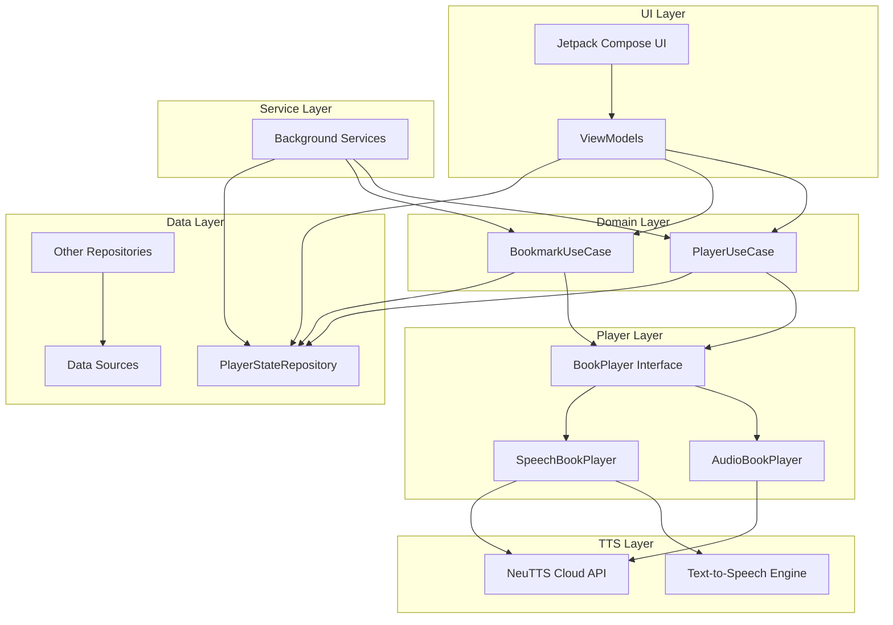

# NeuRead Android

[](https://opensource.org/licenses/MIT)
[](https://www.android.com/)
[](https://kotlinlang.org/)
[](https://play.google.com/store/apps/details?id=com.psimandan.neuread)

Ultimate Text-to-Speech and Audiobook Player for Android - Listen to your books with high-quality AI voices!


## Overview

NeuRead is an Android application that converts text to speech using state-of-the-art AI models. It allows you to listen to your books while running, exercising, or on the go. It supports various e-book formats and provides a clean, intuitive interface for managing your library and controlling playback with both local TTS and cloud-based AI voices.

## Features

- **Advanced AI Voices**: High-quality, natural-sounding voices (Mateo, Greta, Juliette, Jo, Dave)
- **Voice Cloning**: Create your own digital voice by recording a short sample (supports English, Spanish, French, German, and Romanian)
- **Text-to-Speech Playback**: Convert any text or e-book to speech
- **Seamless Transitions**: Switch between local TTS and high-quality AI audio tracks instantly
- **MP3 Audiobook Support**: Listen to high-quality audiobooks generated using the RANDR pipeline
- **Bookmarks**: Save and jump to specific positions in your books
- **Speed Control**: Adjust playback speed to your preference
- **Library Management**: Organize your books in a clean, intuitive interface
- **E-book Format Support**: Read EPUB, PDF, plain text files, and custom `.randr` archives
- **Background Playback**: Continue listening even when the app is in the background
- **Media Controls**: Control playback from your lock screen or notification
- **Highlighting**: Follow along with highlighted text as it's being read

**Download and use the app for free!**

## Installation

### From Source

1. Clone the repository:
   ```
   git clone https://github.com/numipasaaa/NeuRead.git
   ```

2. Open the project in Android Studio

3. Build and run the app on your device or emulator

---

## Architecture

NeuRead follows the MVVM (Model-View-ViewModel) architecture pattern and is built with modern Android development tools and libraries.

### High-Level Architecture



### Key Architectural Features

- **Clean Architecture**: Separation of concerns with distinct layers
- **MVVM Pattern**: Reactive UI with ViewModels managing state
- **Hybrid Playback Engine**: Seamlessly switches between local TTS (`SpeechBookPlayer`) and AI Audio (`AudioBookPlayer`)
- **Dependency Injection**: Hilt for clean dependency management
- **Single Responsibility**: Each component has a focused purpose
- **Testable Design**: Interfaces and dependency injection enable easy testing
- **Modern Android**: Built with Jetpack Compose and latest Android APIs

For detailed architecture documentation with comprehensive diagrams, see [ARCHITECTURE.md](docs/ARCHITECTURE.md).

## Technologies Used

- **Kotlin**: Modern, concise programming language for Android
- **Jetpack Compose**: Declarative UI toolkit for building native Android UI
- **Coroutines & Flow**: For reactive asynchronous programming
- **Hilt**: For dependency injection
- **Media3 (ExoPlayer)**: For high-precision audio playback
- **Android TTS & NeuTTS API**: For multi-engine speech conversion
- **Jetpack Navigation**: For in-app navigation
- **DataStore**: For preferences and cloned voice storage

## NeuTTS Server Setup

### Prerequisites

- Python 3.10+
- NVIDIA GPU with CUDA support (recommended for performance)
- At least 8GB of VRAM

### Running the Server

1. **Install dependencies:**
   ```bash
   pip install -r requirements.txt
   ```

2. **Start the FastAPI server:**
   ```bash
   python server.py
   ```


## Contributing

We welcome contributions from the community! Whether you're fixing bugs, adding features, or improving documentation, your help is appreciated.

### Development Setup

1. **Prerequisites**
   - Android Studio Electric Eel or later
   - JDK 11 or later
   - Android SDK with API level 24+

2. **Clone and Setup**
   ```bash
   git clone https://github.com/numipasaaa/NeuRead.git
   cd NeuRead
   ```

3. **Open in Android Studio**
   - Open the project in Android Studio
   - Let Gradle sync complete
   - Run the app on an emulator or device

### How to Contribute

1. **Fork the repository**
2. **Create your feature branch**
   ```bash
   git checkout -b feature/amazing-feature
   ```
3. **Make your changes**
   - Follow the existing code style
   - Add tests for new functionality, if possible
   - Update documentation as needed
4. **Commit your changes**
   ```bash
   git commit -m 'Add some amazing feature'
   ```
5. **Push to your branch**
   ```bash
   git push origin feature/amazing-feature
   ```
6. **Open a Pull Request**

### Code Style Guidelines

- Follow [Kotlin coding conventions](https://kotlinlang.org/docs/coding-conventions.html)
- Use meaningful variable and function names
- Keep functions small and focused
- Write unit tests for new features, if possible

### Areas for Contribution

- **Bug Fixes**: Check our [Issues](https://github.com/answersolutions/runandread-android/issues)
- **New Features**: E-book format support, UI improvements, accessibility features
- **Documentation**: Code comments, user guides, architecture documentation
- **Testing**: Unit tests, integration tests, UI tests
- **Localization**: Translations for different languages
- **Accessibility**: Improving app accessibility for all users


## License

This project is licensed under the MIT License - see the [LICENSE](LICENSE) file for details.

## Acknowledgments

- Thanks to all the open-source libraries that made this project possible
- Special thanks to our beta testers for their valuable feedback
